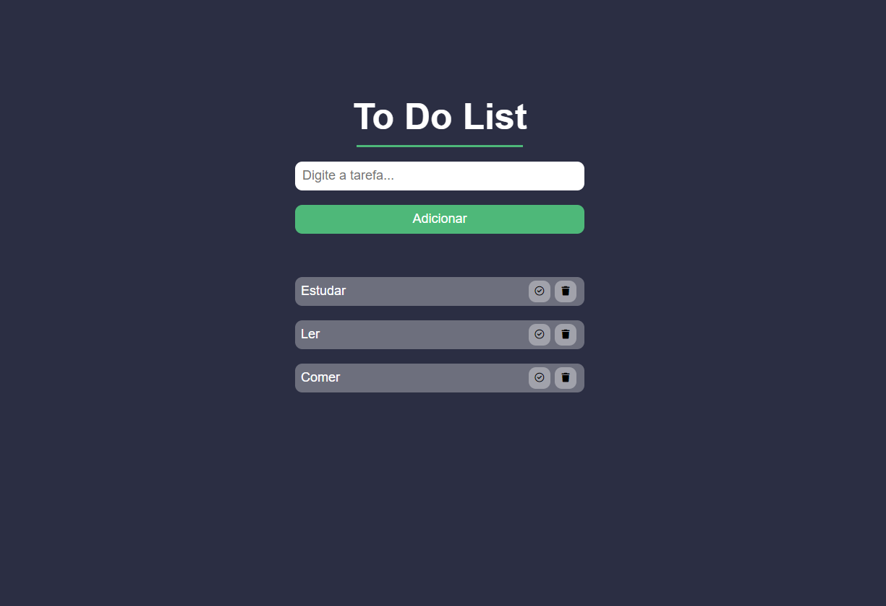

<h1 align="center"> Projeto Calculadora </h1>

  <a href="#-sobre">Sobre</a>&nbsp;&nbsp;&nbsp;|&nbsp;&nbsp;&nbsp;
  <a href="#-projeto">Projeto</a>&nbsp;&nbsp;&nbsp;|&nbsp;&nbsp;&nbsp;
  <a href="#-tecnologias">Tecnologias</a>&nbsp;&nbsp;|&nbsp;&nbsp;&nbsp;&nbsp;
  <a href="#-Serviços">Serviços</a>&nbsp;&nbsp;&nbsp;|&nbsp;&nbsp;&nbsp;
  <a href="#-Autor">Autor</a>&nbsp;&nbsp;&nbsp;&nbsp;&nbsp;&nbsp;

## 🎯 Sobre

Um gerenciador de tarefas no qual você pode confiar 

 

## 📷 Projeto

- Aqui esta um preview do projeto concluido

 

## 🚀 Tecnologias

Esse projeto foi desenvolvido com as seguintes tecnologias:

- HTML e CSS
- JavaScript
- Git e GitHub

 

## 🛠️ Serviços

- <a href="github.com/Matheus-Ellenberger">GitHub</a> - Hospedagem
- <a href="fontawesome.com">Font Awesome</a> - Icones

 

## 🙋‍♂️ Autor

Feito com ❤️ por Matheus Ellenberger

